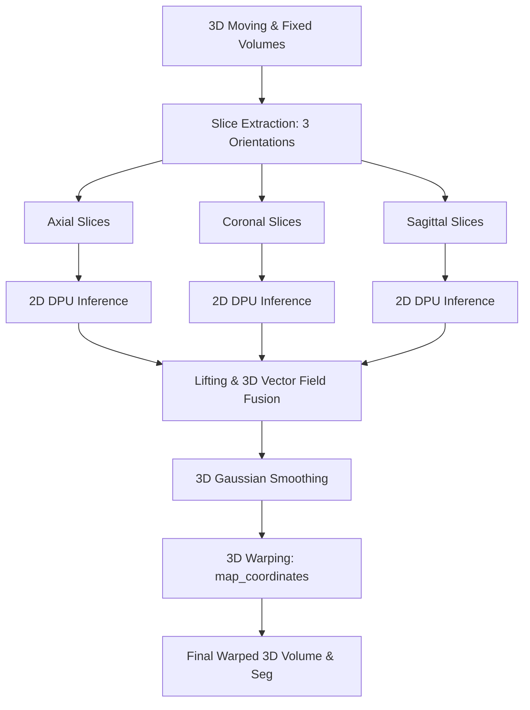

# Project Developer Guide: 2.5D VoxelMorph on AMD FPGA

This document serves as a comprehensive developer reference guide for the **2.5D VoxelMorph Medical Image Registration** deployment pipeline on AMD FPGAs (VEK280 / Zynq UltraScale+ MPSoC). It details the architecture, the end-to-end compilation pipeline, the telemetry system, the file layout, and step-by-step instructions for team members to compile and run new models.

---

## 1. Project & System Architecture

The goal of this project is to register 3D medical image volumes (brain MR to CT scans) on resource-constrained edge hardware. Instead of running a computationally heavy 3D convolution network, we employ a **2.5D multi-view registration architecture**:



### Key Stages:
1.  **2.5D Slice Extraction**: Slices are extracted along three orthogonal orientations: Axial (axis 0), Coronal (axis 1), and Sagittal (axis 2). A window radius of $wr=1$ is used, creating 3-channel slice stacks (neighboring slices provide spatial context to the 2D network).
2.  **DPU Inference**: The 2D registration network runs on the FPGA's **Deep Learning Processing Unit (DPU)**, predicting a 2D deformation flow field for each slice.
3.  **Lifting & Fusion**: The 2D flow fields are projected ("lifted") back into a 3D coordinate space and averaged (fused) to create a single coherent 3D displacement vector field.
4.  **Gaussian Smoothing**: The fused vector field is smoothed with a Gaussian kernel ($\sigma=0.75$) to enforce spatial regularization.
5.  **3D Warping (Post-Processing)**: The moving MR volume and its corresponding segmentation maps are warped on the board's ARM CPU using SciPy's `map_coordinates` (trilinear interpolation for volumes, nearest-neighbor for segmentations).

---

## 2. Telemetry, Calibration, and Benchmarking

To measure hardware acceleration gains, the deployment notebook includes a native, process-isolated telemetry system that compares the **FPGA DPU (hardware NPU)** against the **ARM CPU (PyTorch CPU)**.

### Dynamic Energy Profiling:
Measuring total power during execution includes the board's background idle power, which distorts algorithm efficiency. We isolate the algorithm's power footprint using a **calibration phase**:
1.  Prior to execution, the system samples power rails (`INT` for the DPU, `PSINTFP` for the ARM CPU) at 100ms intervals for 3 seconds to calculate average idle baselines ($P_{\text{idle\_dpu}}$ and $P_{\text{idle\_cpu}}$).
2.  During registration, active power is integrated over time, and the idle baseline is subtracted:
    $$E_{\text{dynamic}} = \int (P(t) - P_{\text{idle}}) \, dt$$

### Telemetry Metrics Recorded:
For each subject pair in both CPU and DPU modes, the benchmark records:
*   **Dice Similarity Coefficient (DSC)**: Measures registration accuracy across 16 anatomical labels.
*   **Model Latency (`Model ms`)**: Raw neural network inference execution time.
*   **Post-processing Latency (`Post ms`)**: Time spent performing 3D warping and metric evaluation on the ARM CPU.
*   **Total Latency (`Total ms`)**: Combined inference and post-processing runtime.
*   **Dynamic Energy (`Dyn Energy`)**: Dynamic Joules consumed specifically by the registration algorithm.
*   **Peak RSS Memory (`Max RSS`)**: Bounded RAM footprint to ensure stability and detect memory leaks.

---

## 3. File-by-File Technical Directory

Here are the files in this workspace and their functions:

### 1. `vitis_run.py` (Host Machine)
*   **Purpose**: Manages the model preparation and compilation pipeline.
*   **Usage**: Run this on the host machine/Docker container to convert PyTorch weights (`.pth`) into compiled DPU binaries (`.xmodel`).
*   **Flow**:
    1.  Loads PyTorch model architecture.
    2.  Exports model to ONNX format.
    3.  Runs the Vitis AI Quantizer (`vai_q_pytorch`) to quantize the model from FP32 to INT8.
    4.  Runs the Vitis AI Compiler (`vai_c`) to produce the `.xmodel` file targeted for the specific DPU fingerprint of your board.

### 2. `update_nb.py` (Host Machine)
*   **Purpose**: Notebook compilation script. 
*   **Usage**: The Jupyter notebook running on the board (`fpga_inference.ipynb`) is compiled by this script. To modify notebook cells, edit the python string blocks inside `update_nb.py` and run it:
    ```bash
    python3 update_nb.py
    ```
    This avoids manually editing large notebook JSON files and keeps helper code under proper source control.

### 3. `prepare_benchmark_data.py` (Host Machine)
*   **Purpose**: Extracts and partitions raw patient volumes from the dataset directory into `.npy` slice stacks. It isolates the 9 validation pairs to be uploaded to the board for the benchmark run.

### 4. `Voxelmorph/2.5D/fpga_inference.ipynb` (Board)
*   **Purpose**: The main Jupyter notebook executed on the FPGA board. It contains:
    *   DPU driver loading and input tensor scaling.
    *   3-second power rail calibration.
    *   A single-slice registration visualizer (Cell 7) showing the Moving, Fixed, Warped, Flow Field (quiver), and Segmentation maps side-by-side.
    *   The 9-pair comparative loop (Cell 8) running CPU vs FPGA.
    *   Comparative charting (Cell 9) plotting Latency, Energy, and Dice metrics, and printing derived green-computing stats.

---

## 4. Replicating the Pipeline (Step-by-Step)

If the team trains a new model, follow these steps to compile and deploy it:

### Step 1: Compile the New Model on the Host
Place the new weights (`new_model.pth`) in the weights directory on your host machine. Run the compilation pipeline to generate the NPU binary:
```bash
python3 vitis_run.py --weights ./trained_weights/new_model.pth --output_root ./compiled_output
```
This will output `new_model.xmodel` (for the FPGA) and an unwrapped checkpoint for the PyTorch CPU benchmark.

### Step 2: Upload Files to the Board
Connect the board to your local network and copy the files to the running Jupyter workspace via SCP:
```bash
# Upload compiled model weights
scp ./compiled_output/new_model.xmodel xilinx@10.79.3.26:/home/xilinx/jupyter_notebooks/fpga_run_new/

# Upload CPU model weights for comparison
scp ./trained_weights/new_model.pth xilinx@10.79.3.26:/home/xilinx/jupyter_notebooks/fpga_run_new/

# Upload the latest compiled Jupyter notebook
scp ./Voxelmorph/2.5D/fpga_inference.ipynb xilinx@10.79.3.26:/home/xilinx/jupyter_notebooks/fpga_run_new/
```

### Step 3: Run the Benchmarks on the Board
1.  Open the Jupyter web interface at `http://10.79.3.26:8888`.
2.  Open `fpga_inference.ipynb`.
3.  Select **Kernel -> Restart & Run All**.
4.  Once completed, scroll to the bottom to examine:
    *   The Comparative markdown summary table.
    *   The **`benchmark_charts.png`** (bar charts showing latency speedup, energy savings, and Dice comparisons).
    *   The printed green-computing report showing slices/second throughput and slices/Joule energy efficiency.

*Note: If you only want to regenerate the performance charts without waiting for the 20-minute benchmark to run again, upload the updated notebook and run only the final cell (Cell 9). It will instantly load the saved `benchmark_results_comparison.json` file and render the charts.*

---

## 5. Key Technical Lesson: Aspect Ratio Distortion

During initial deployments, a gap was observed between the FPGA average Dice score (~0.67) and the training server baseline (~0.76). Our investigation isolated the cause to **aspect ratio stretching**:

1.  **Fixed Input Shape**: The current compiled model uses a fixed input shape of **112x96** (a non-square 7:6 aspect ratio).
2.  **Anatomical Stretching**: Raw MR/CT scans have varying dimensions (e.g. 192x192). In the preprocessing helper code, slices are stretched using `cv2.resize` to fit the 112x96 shape.
3.  **Orientation Inconsistency**: Stretches are applied differently along the three axes:
    *   *Axial view*: Stretched from 208 to 96 (0.46x).
    *   *Coronal view*: Stretched from 192 to 96 (0.50x).
4.  **Compound Error**: Squashing the brain anatomy differently in each orientation causes the predicted 2D flow fields to be spatially mismatched. When lifted and fused in 3D, these errors compound, dragging down the final Dice score.

### Recommendation for Next Model Run:
For the next training run, **retrain and recompile the model for square dimensions** (e.g. 112x112 or 128x128). This allows the preprocessing stage to use symmetric padding or cropping rather than stretching, preserving physical anatomical proportions and closing the accuracy gap.
